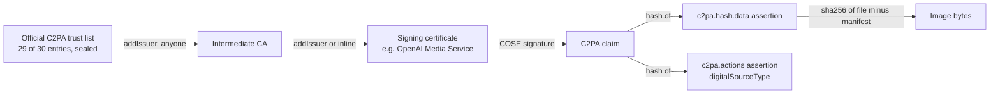

# Unstripped

**Find out where an image came from, even after its metadata was stripped.**

OpenAI, Google, Adobe and a growing list of phone makers sign every image they produce with a C2PA Content Credential. The signature lives in the file's metadata, and most platforms delete metadata on upload. Once it is gone, nobody can tell the image came from ChatGPT.

Unstripped is a public registry on Monad that keeps a copy of each credential **after the chain itself has verified it**. The contract checks the certificate chain up to the official C2PA trust list, the signature over the claim, and the hash the claim binds to the image bytes. A copy whose metadata was stripped still hashes to that signed value, so anyone can look it up: a person, a smart contract, an AI agent.

- Live app: **https://unstripped.vercel.app** (drop a PNG or JPEG, or try one of the sample images; recording a credential needs no wallet)
- Registry: [`0xd50E50dE55318102471720021014bB311366ebA4`](https://testnet.monadvision.com/address/0xd50E50dE55318102471720021014bB311366ebA4) on Monad testnet
- Example integration: [`LabeledFeed` 0xA288b6CAbC4C5fe9eEE68e39391CF775Eed29F98](https://testnet.monadvision.com/address/0xA288b6CAbC4C5fe9eEE68e39391CF775Eed29F98)

## Why this needs to exist

C2PA solved signing. It has not solved survival. Its answer for stripped files is a *manifest repository*: a server that stores manifests so a stripped copy can be matched back. Today those repositories are run by Adobe and by watermarking vendors, loosely federated, and you have to trust whoever runs them that the manifest they return really belongs to the image.

A public chain is the obvious neutral directory, but only if it cannot be polluted. Anchoring a hash someone claims is worthless; anyone can claim anything. So Unstripped does the expensive part on chain: it verifies the issuer's signature before it records a single byte. Nobody, including whoever submits a credential and including me, can add a record that OpenAI or Google did not sign.

## What the contract verifies



`register(credential)` runs, in one transaction:

1. **Certificate chain.** Parses the X.509 signing certificate (DER, walked field by field, no caller-supplied offsets) and checks that a known issuer signed it.
2. **Claim signature.** Rebuilds the COSE `Sig_structure` over the claim and verifies it with the certificate's key: PS256 (RSA-PSS) through the modexp precompile, or ES256 through Monad's native P256 precompile.
3. **Binding to the pixels.** Finds the `c2pa.hash.data` assertion the signed claim lists, checks its hash, and reads the asset hash out of it. This equals `sha256(file with the manifest removed)`: the `caBX` chunk for PNG, the APP11 segments for JPEG. That is the hash of a stripped copy.
4. **AI disclosure.** Verifies the `c2pa.actions` assertion the same way and records whether the signer declared `trainedAlgorithmicMedia`.

Then it stores `{signer org, signer name, generator, AI-generated, source type, algorithm}` under the asset hash.

### Measured on Monad testnet

| Operation | Gas |
|---|---|
| `register`, OpenAI credential (PS256, signing cert checked against an RSA-4096 CA inline) | 1,161,741 |
| `register`, Gemini credential (ES256, P256 precompile) | 602,083 |
| `addIssuer`, RSA-4096 parent | 753,496 |
| `addIssuer`, P-384 parent (hinted, see below) | 7,157,222 |
| `LabeledFeed.post`, label read from the registry | 201,757 |

Transactions for every line are in [`deployments/monadTestnet.json`](deployments/monadTestnet.json).

## Why Monad

Each registration verifies real certificate cryptography: an RSA-4096 or P-384 certificate signature and an RSA-PSS or P-256 claim signature, plus parsing of X.509 and CBOR, in a single transaction. That is 0.6 to 1.2 million gas per image. On Monad it confirms in about a second at testnet fees, and the native P256 precompile (`0x100`, RIP-7212) verifies the ES256 signatures that Google and phone cameras use natively, where Solidity would need millions of gas. A registry that anyone can write to only works if writing is cheap enough that the first person who sees an image can afford to record it.

## Trust model

- **Anchors are the official C2PA trust list**, [downloaded](fixtures/trust-list/) from `c2pa-org/conformance-public`: 29 of its 30 entries, covering Google (including the Pixel camera CAs), Adobe, DigiCert, SSL.com, Huawei, Xiaomi and others. The 30th is vivo's root, which uses P-521, a curve the registry cannot verify yet. The deployer added the anchors once and called `seal()`. After that there is no admin function in the contract.
- **Everything below an anchor is permissionless.** `addIssuer(tbs, sig, parent, hints)` adds an intermediate CA or a signing certificate if the parent's signature over it verifies. When OpenAI or Google rotates its signing certificate, the first person to register an image signed by the new one adds it; the relayer does this automatically. Manifests usually stop below the root, so the relayer finds the trust-list entry the top certificate names as its issuer ([`sdk/anchors.json`](sdk/anchors.json)) and adds the chain under it.
- **P-384 runs in Solidity.** 25 of the 29 anchors use P-384, which no EVM precompile supports. The registry uses Solarity's `ECDSA384` as vendored and audited in [base/nitro-validator](https://github.com/base/nitro-validator), with off-chain *inverse hints*: the caller supplies each modular inverse, and the contract checks `b * inv = 1 mod m` instead of computing it. A wrong hint can only make the call revert, never accept a bad signature. Without hints the same check costs about 53M gas on Monad, above its 30M per-transaction limit. With hints it costs about 7.2M, and it is paid once per certificate.
- **The relayer cannot forge anything.** It only pays gas. It simulates every call first, so an invalid credential costs nothing and fails with the contract's error.

## Use it from your app

**Solidity.** Read the registry with the two-function [`IContentCredentials`](contracts/IContentCredentials.sol) interface:

```solidity
import {IContentCredentials} from "unstripped/contracts/IContentCredentials.sol";

IContentCredentials constant CREDENTIALS = IContentCredentials(0xd50E50dE55318102471720021014bB311366ebA4);

// imageHash = sha256 of the image as your user uploaded it
bool known = CREDENTIALS.isRegistered(imageHash);
bool ai = CREDENTIALS.isAIGenerated(imageHash);
```

[`LabeledFeed`](contracts/examples/LabeledFeed.sol) is a complete example: every post is labeled by the contract at posting time, so the poster cannot remove the label.

**TypeScript.** [`sdk/registry.ts`](sdk/registry.ts) and [`sdk/c2pa.ts`](sdk/c2pa.ts) run in Node and the browser:

```ts
import { registry, lookup } from "./sdk/registry";

const cc = registry("0xd50E50dE55318102471720021014bB311366ebA4", provider);
const { assetHash, provenance } = await lookup(cc, imageBytes);
// provenance: { signerOrg: "OpenAI OpCo, LLC", generator: "OpenAI Media Service API", aiGenerated: true, alg: -37, ... }
```

`lookup` accepts both a file that still carries its manifest and a stripped copy.

**Post from a script.** [`scripts/post.ts`](scripts/post.ts) looks an image up and posts it to `LabeledFeed`, printing the record, the registration transaction and the label the feed wrote:

```bash
IMAGE=path/to/stripped.png npx hardhat run scripts/post.ts --network monadTestnet
```

**Record a credential without a wallet.** `POST https://unstripped.vercel.app/api/register` with `{ credential, chain }` as produced by `credentialJSON(extract(file), issuer)` and `chainJSON(extract(file))`. It returns the asset hash and transaction, or the contract's revert reason.

## Run it

```bash
npm install && (cd web && npm install)
npx hardhat test                                     # 22 tests on real OpenAI and Google files, incl. tampering cases
npx hardhat run scripts/deploy.ts --network monadTestnet
cd web && npm run dev
```

Tests use real credentials: [`fixtures/`](fixtures/) holds images generated with OpenAI's `gpt-image-1` (PNG and JPEG, both of its signing chains, SSL.com RSA and Trufo P-384) and Google's Gemini 2.5 Flash Image.

## Limits

- **Exact bytes only.** A stripped copy matches; a re-encoded or resized copy does not, because every byte changes. Covering those needs C2PA soft bindings (invisible watermarks such as SynthID or TrustMark), which a contract cannot verify. A future version can store watermark identifiers as unverified hints next to the verified record.
- **PNG and JPEG** in the SDK so far. WebP, HEIC and video carry C2PA in other containers; the contract logic is the same, each needs an extractor.
- **Not checked yet:** certificate validity periods against the signing time, revocation (OCSP), and the C2PA time-stamp. All three are verifiable on chain with the same primitives and are next.
- P-521 (one trust-list entry) is not supported.

## Credits and tools

- `contracts/vendor/nitro/` is MIT-licensed code from [base/nitro-validator](https://github.com/base/nitro-validator), which vendors Solarity's [`ECDSA384`](https://github.com/dl-solarity/solidity-lib); `tools/p384_hints.js` comes from the same repository.
- I built this with Claude Code as my coding assistant. The demo voiceover is an ElevenLabs clone of my own voice.

MIT License.
